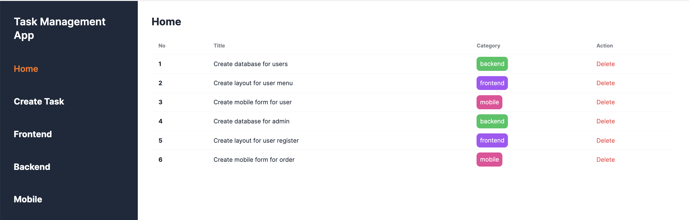
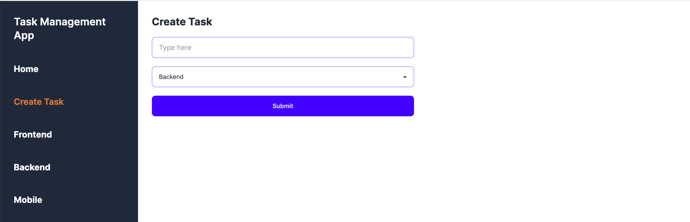
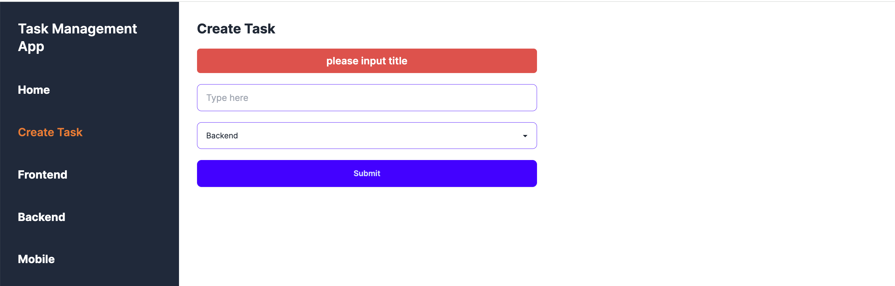
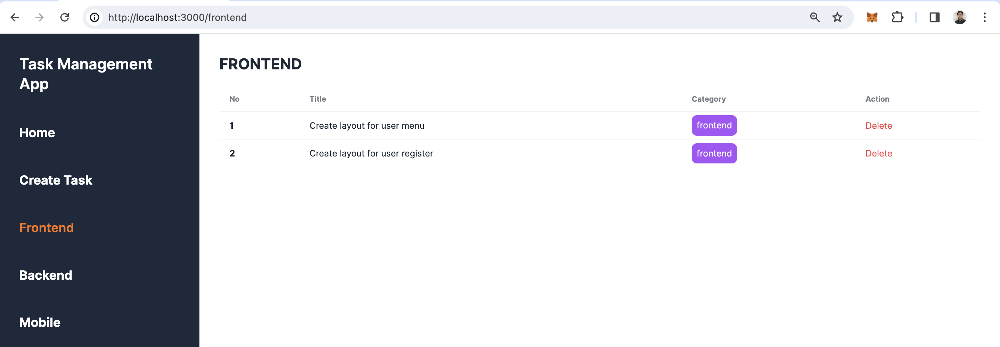

[](https://classroom.github.com/online_ide?assignment_repo_id=15373744&assignment_repo_type=AssignmentRepo)
# Task Management App

## Summary

Buatlah aplikasi Task Management menggunakan React. Dalam aplikasi ini, terdapat
tiga kategori task yaitu: `backend`, `frontend` dan `mobile`. User bisa melihat
task apa saja yang ada berdasarkan kategori yang dipilih. Silakan menggunakan
`json-server` untuk menyingkat waktu!

## Competencies

- Typescript
- NEXT.js
- Reusable Component

## Github Live Code Workflow

Dalam pengerjaan live code, kalian diminta untuk melakukan commit sebagai checkpoint pengerjaan. Jika pengerjaan release sudah selesai, segera lakukan `add-commit` dengan message release yang jelas.

- Contoh 1: git commit -m "Release 0 Done"
- Contoh 2: git commit -m "Release 3 - Fetch: Done"

Instructor juga akan meminta commit dalam waktu tertentu, pastikan kalian melakukan `add-commit` juga ketika instructor meminta melakukan commit.

## Release 0

Silahkan gunakan `json-server` sebagai database pada aplikasi ini.

Skema dari task adalah sebagai berikut:

```json
{
  "id": Number,
  "title": String,
  "category": String
}
```

Pada sisi client, Lakukan setup project dengan menginstall package yang sudah diajarkan sebelumnya:

1. Next.js
2. Typescript
3. Eslint
4. CSS Framework

Pada Live Code ini, kalian dibebaskan membuat design aplikasi yang kalian kerjakan namun pastikan aplikasi memiliki layout yang baik agar mendapatkan nilai maksimal. Setiap release akan terdapat referensi tampilan yang bisa kalian ikuti untuk efisiensi waktu.

## Release 1

Buatlah sebuah halaman dengan path `/` yang menampilkan semua data task. Di
setiap item-nya, tambahkan button `Delete`.



Notes:
Wajib menggunakan server component (SSR) dan fetch data di server

## Release 2

Buatlah sebuah halaman dengan path `/create-task` yang berisi form untuk
menambahkan task. Data yang bisa di-input oleh user adalah `Category` dan
`Title`.

Pastikan user kembali ke halaman `/` ketika berhasil menyimpan data `Task`.

Pastikan `Task` yang baru kalian buat sudah terlihat pada list di halaman `/`.


Notes:
Pada halaman ini dapat kamu buat dengan menerapkan server component atau client component.

## Release 3

Tambahkan validation yang mengharuskan user mengisi `Title` saat create task.



Notes:
Semua input harus terisi sebelum menyimpan data ke database, jika ada yang belum terisi, infokan dengan message yang jelas
Tampilkan sebuah feedback ketika ada data yang belum terisi pada form, feedback ini dapat berbentuk custom component, modal, toast atau package lainnya tetapi tidak diperbolehkan menggunakan fungsi `alert()` javascript.

## Release 4

Tambahkan fitur untuk melakukan filter di path `/frontend`, `/backend`, dan `/mobile` agar user bisa melihat data dari kategori yang dipilih.

Notes:
Wajib menggunakan server component (SSR) dan fetch data di server
Wajib menggunakan reusable component



## Release 5

Implementasikan `Delete` button untuk menghapus task di path `/`, maupun `/:category`.
Data yang berhasil dihapus tidak ditampilkan lagi (reaktif) pada halaman yang menampilkan daftar `Task`.
